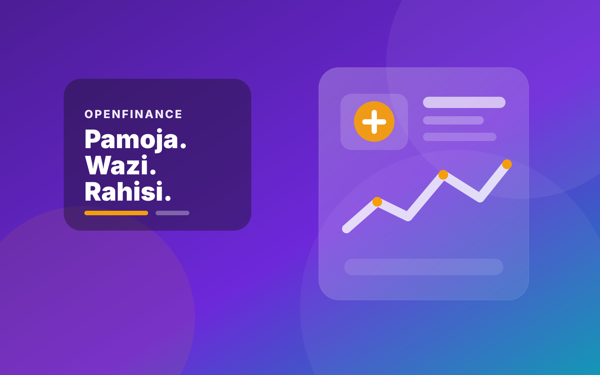
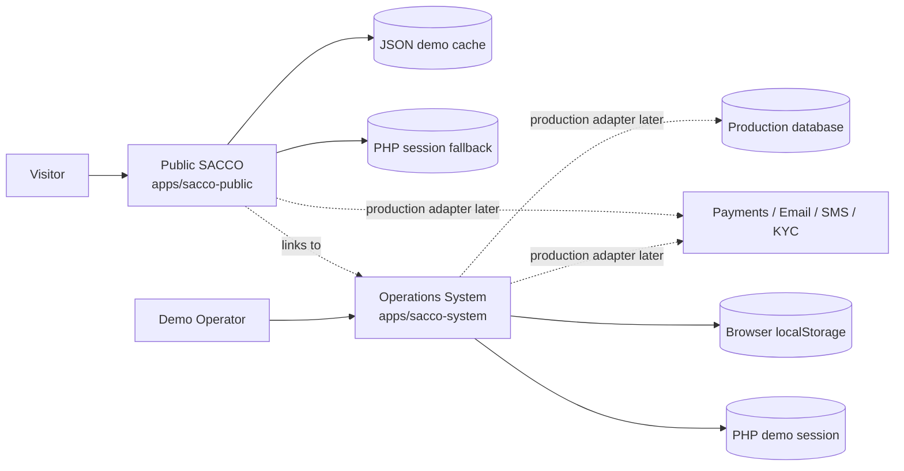

<p align="center">
  <strong>VALRON OPEN-SOURCE R&D</strong>
</p>

<h1 align="center">OpenFinance</h1>

<p align="center">
  <strong>A self-contained SACCO website + operations-system demo for learning, prototyping and portfolio use.</strong>
</p>

<p align="center">
  <a href="https://sacco.valron.co.ke"><strong>Public SACCO Demo</strong></a>
  ·
  <a href="https://system-sacco.valron.co.ke"><strong>Operations Demo</strong></a>
  ·
  <a href="#installation"><strong>Installation</strong></a>
  ·
  <a href="#architecture"><strong>Architecture</strong></a>
</p>

<p align="center">
  
  
  
  
  
</p>

---

<table>
<tr>
<td width="50%">

<strong>Public SACCO experience</strong><br>
A front-facing cooperative-finance website with membership, savings, lending, calculators, application tracking, resources and demo enquiries.
</td>
<td width="50%">

<strong>Operations system</strong><br>
A browser-cached workspace for members, contributions, loans, guarantors, ledger activity, receipts, expenses, support and reporting.
</td>
</tr>
</table>

> [!IMPORTANT]
> OpenFinance is a **software demonstration**, not a licensed SACCO, bank, lender, payment provider or production core-banking platform. All bundled records are synthetic. Do not enter real personal, financial or regulated data.

## Why OpenFinance exists

Financial-system demos often become difficult to run because the UI is tightly coupled to production databases, payment gateways, SMS providers, identity systems or private credentials. OpenFinance deliberately separates the **experience layer** from those dependencies.

The result is a repository that can be cloned and explored without:

- MySQL or PostgreSQL;
- Composer or npm;
- Firebase/Auth0;
- M-Pesa or card credentials;
- email or SMS provider keys;
- KYC integrations;
- cloud infrastructure.

It is intended for developers, founders, students and product teams who want to understand how a SACCO-style product can be structured before implementing production infrastructure.

## What is included

| Surface | Intended URL | Purpose | Demo persistence |
|---|---|---|---|
| **SACCO Public** | `sacco.valron.co.ke` | Acquisition, education, membership, savings, loans, calculators, forms and application tracking | Local JSON cache when writable, PHP session fallback |
| **SACCO System** | `system-sacco.valron.co.ke` | Members, contributions, lending, guarantors, ledger, receipts, expenses, support and reporting | PHP demo session + browser `localStorage` |

### Public SACCO demo

The public application includes:

- responsive SACCO landing page;
- membership explainer;
- savings and lending sections;
- repayment and savings calculators;
- demo membership application flow;
- demo application-status lookup;
- contact/enquiry form;
- financial-literacy/resource section;
- local placeholder illustration;
- environment configuration through `.env`;
- JSON/session caching instead of a production member database.

### SACCO operations demo

The internal system includes:

- passwordless demo entry;
- Administrator, Finance and Member Services demo roles;
- KPI dashboard;
- member list;
- contributions;
- loans;
- guarantors;
- ledger;
- receipts;
- expenses;
- communications queue;
- support tickets;
- reports;
- settings;
- resettable synthetic dataset stored in the browser.

## Demo philosophy

OpenFinance follows three rules:

1. **No secret is required to explore it.**
2. **No external API is called just to make the demo look functional.**
3. **Production integrations are represented as replaceable boundaries.**

This makes the repository safe to fork and easy to reason about.

## Architecture



## Project structure

```text
OpenFinance/
├── apps/
│   ├── sacco-public/
│   │   ├── assets/
│   │   │   ├── app.css
│   │   │   ├── app.js
│   │   │   └── openfinance-hero.svg
│   │   ├── storage/
│   │   │   └── demo/
│   │   ├── .env.example
│   │   ├── .htaccess
│   │   └── index.php
│   └── sacco-system/
│       ├── assets/
│       │   ├── system.css
│       │   ├── store.js
│       │   └── demo-finance.svg
│       ├── .htaccess
│       └── index.php
├── docs/
│   ├── INSTALLATION.md
│   ├── ARCHITECTURE.md
│   └── PRODUCTION-CHECKLIST.md
├── CONTRIBUTING.md
├── SECURITY.md
└── LICENSE
```

# Installation

OpenFinance is deliberately compatible with conventional PHP/shared hosting.

## Requirements

You need:

- PHP **8.0+**; PHP 8.2 or newer is recommended;
- Apache, LiteSpeed, Nginx, or PHP's built-in development server;
- Git if cloning;
- write permission for `apps/sacco-public/storage/demo/` if you want JSON persistence;
- a modern browser with `localStorage` enabled for the system demo.

No database server is required for demo mode.

## Option A — local installation

### Step 1: clone the repository

```bash
git clone https://github.com/wanjohi-11/OpenFinance.git
cd OpenFinance
```

### Step 2: create the public-site environment file

Linux/macOS:

```bash
cp apps/sacco-public/.env.example apps/sacco-public/.env
```

Windows PowerShell:

```powershell
Copy-Item apps/sacco-public/.env.example apps/sacco-public/.env
```

### Step 3: configure local URLs

Edit `apps/sacco-public/.env`:

```dotenv
APP_NAME="OpenFinance"
APP_URL=http://127.0.0.1:8080
APP_ENV=demo
APP_DEBUG=true
SYSTEM_URL=http://127.0.0.1:8081
CONTACT_EMAIL=demo@example.test
GITHUB_URL=https://github.com/wanjohi-11/OpenFinance
```

### Step 4: make the demo cache writable

Linux/macOS:

```bash
chmod -R 775 apps/sacco-public/storage/demo
```

Use the least-permissive setting that works for your server. You normally do not need `777`.

### Step 5: run the public site

Open terminal 1:

```bash
php -S 127.0.0.1:8080 -t apps/sacco-public
```

Visit:

```text
http://127.0.0.1:8080
```

### Step 6: run the operations system

Open terminal 2:

```bash
php -S 127.0.0.1:8081 -t apps/sacco-system
```

Visit:

```text
http://127.0.0.1:8081
```

### Step 7: enter the demo system

No password is required.

1. Enter a display name such as `Demo Administrator`.
2. Choose **Administrator**, **Finance**, or **Member Services**.
3. Select **Enter OpenFinance**.
4. Explore the modules from the sidebar.
5. Add or modify synthetic records.
6. Refresh the page to confirm browser persistence.
7. Use **Reset demo data** to restore the seed dataset.

### Step 8: test application tracking

The public application ships with a known synthetic record:

```text
Reference: OF-DEMO-001
Email:     demo@example.com
```

Use those values on the application-status page.

## Option B — cPanel/shared-hosting installation

### Step 1: create the two subdomains

Create:

```text
sacco.valron.co.ke
system-sacco.valron.co.ke
```

Use separate document roots, for example:

```text
/home/USERNAME/public_html/sacco/
/home/USERNAME/public_html/system-sacco/
```

### Step 2: upload the public application

Upload the **contents** of:

```text
apps/sacco-public/
```

into the document root for `sacco.valron.co.ke`.

The final path should look like:

```text
.../public_html/sacco/index.php
```

not:

```text
.../public_html/sacco/sacco-public/index.php
```

### Step 3: create the public `.env`

Copy `.env.example` to `.env` and use:

```dotenv
APP_NAME="OpenFinance"
APP_URL=https://sacco.valron.co.ke
APP_ENV=demo
APP_DEBUG=false
SYSTEM_URL=https://system-sacco.valron.co.ke
CONTACT_EMAIL=demo@sacco.valron.co.ke
GITHUB_URL=https://github.com/wanjohi-11/OpenFinance
```

No API keys belong in the demo environment file.

### Step 4: set cache permissions

Ensure PHP can write to:

```text
storage/demo/
```

Typical shared-hosting permissions are `0755` or `0775`, depending on ownership.

### Step 5: upload the system application

Upload the **contents** of:

```text
apps/sacco-system/
```

into the document root for `system-sacco.valron.co.ke`.

### Step 6: select PHP 8+

In cPanel **MultiPHP Manager**, **Select PHP Version**, Plesk PHP settings, or the equivalent hosting control:

1. select both subdomains;
2. choose PHP 8.0+;
3. ensure PHP sessions are enabled;
4. apply/save.

### Step 7: enable SSL

Issue SSL certificates for both subdomains using AutoSSL, Let's Encrypt or the provider's SSL feature.

Verify:

```text
https://sacco.valron.co.ke
https://system-sacco.valron.co.ke
```

### Step 8: smoke-test the public site

Check that:

- the home page loads without warnings;
- navigation works on mobile and desktop;
- calculators respond immediately;
- membership applications receive a demo reference;
- `storage/demo/applications.json` updates when the directory is writable;
- status lookup accepts `OF-DEMO-001` + `demo@example.com`;
- system links point to `system-sacco.valron.co.ke`.

### Step 9: smoke-test the operations system

Check that:

- the demo entry page loads;
- all demo roles can enter;
- dashboard figures render;
- members, contributions, loans and ledger modules open;
- synthetic additions survive a refresh;
- reset restores the original dataset;
- the browser network panel shows no payment, SMS, email, Firebase or KYC API call.

## Demo persistence

### Public app

If `storage/demo/` is writable, form submissions are stored in local JSON files. If not, the application falls back to the current PHP session.

That behavior is convenient for demonstrations but is **not** a transactional database.

### Operations system

The internal demo stores its synthetic operational records in browser `localStorage`.

That means:

- each browser/profile has its own dataset;
- clearing site data resets the stored copy;
- private/incognito mode may not retain it;
- no server-side member ledger is created.

## Production integration boundaries

A real implementation could introduce adapters for:

- M-Pesa;
- card payments;
- email;
- SMS;
- authentication/SSO;
- KYC/AML;
- credit bureaus;
- production databases;
- analytics/monitoring.

Those integrations should be added behind server-side interfaces with secrets kept outside Git.

## Moving from demo to production

Do **not** make this production-ready by simply adding a database connection.

A real financial system requires, at minimum:

- secure authentication and RBAC;
- transactional database design;
- integrity constraints and idempotency;
- authoritative accounting rules;
- payment reconciliation;
- audit logs;
- encryption and secrets management;
- backups and recovery testing;
- privacy/retention controls;
- monitoring and incident response;
- automated testing;
- vulnerability management;
- independent security review;
- appropriate legal and regulatory analysis.

See [docs/PRODUCTION-CHECKLIST.md](docs/PRODUCTION-CHECKLIST.md).

## Security

This repository should contain **no production credentials or real member/customer data**. See [SECURITY.md](SECURITY.md).

## Contributing

Issues and pull requests are welcome. See [CONTRIBUTING.md](CONTRIBUTING.md).

## License

OpenFinance is released under the [MIT License](LICENSE).

---

<p align="center">
  <strong>OpenFinance</strong><br>
  A Valron open-source engineering project for replicable financial-system prototyping.
</p>
