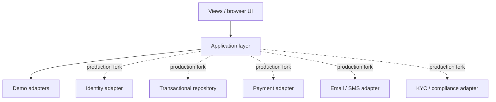

# OpenFinance Architecture

OpenFinance is split into two independent PHP applications.

## Public SACCO application

The public application handles acquisition, education, membership forms, calculators and application-status lookup. Its demo persistence is a local JSON cache with a PHP-session fallback.

## Operations system

The internal system uses PHP sessions for passwordless demo entry and browser localStorage for synthetic operational records.

## Production adapter direction

The purpose of the demo architecture is to keep provider-specific concerns out of the core UX until a production implementation deliberately chooses them.
